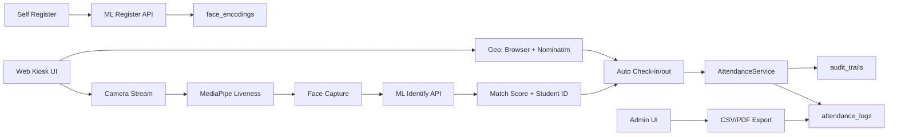

# Attendance System — Detailed Connectivity Graph

Goal: full, easy-to-read system connectivity and feature flow from camera open to attendance, plus admin panel and self-registration.

## 1) High-level Components

- Web Client (kiosk + admin + student pages)
    - Kiosk UI: resources/views/attendance/kiosk.blade.php
    - Admin UI: resources/views/admin/\*
    - Student UI: resources/views/student/\*

- Laravel App (backend)
    - Routes: routes/web.php
    - Controllers: app/Http/Controllers/\*
    - Services: app/Services/AttendanceService.php
    - Models: app/Models/\*
    - Migrations: database/migrations/\*
    - Seeders: database/seeders/\*

- ML Microservice (external)
    - FastAPI + SQLAlchemy
    - Face vector store: face_encodings (external DB)

- External APIs
    - Reverse geocode (client): https://nominatim.openstreetmap.org
    - IP geolocation (server fallback): ip-api.com (http), ipapi.co (https)

## 2) End-to-End Flow: Kiosk Attendance (Check-in / Check-out)

1. Camera open
    - Kiosk page loads MediaPipe FaceMesh (client-side WASM).
    - Browser requests camera permissions and starts video stream.

2. Liveness challenge
    - Client runs blink/head movement checks.
    - Liveness score and spoof check flags are computed in the browser.

3. Face capture
    - Client captures a still frame or face vector payload.
    - Client attaches liveness metrics (score, blink count, yaw variance).

4. ML identification
    - Client POSTs to ML identify endpoint (via Laravel API proxy or direct route): /api/identify-face
    - ML service compares to stored encodings and returns match_score + matched student_id.

5. Attendance auto check-in/out
    - Client POSTs to /attendance/auto-checkin or /attendance/auto-checkout with:
        - student_id (from ML match)
        - liveness_score, match_score
        - geo payload (address, lat, lng, accuracy) if available
    - Laravel validates liveness + match threshold.

6. Geo capture and fallback
    - Client tries navigator.geolocation and reverse-geocode (Nominatim).
    - If client geo missing, AttendanceService.ipGeolocation() tries IP-based lookup.

7. Database persistence
    - AttendanceService creates AttendanceLog rows with:
        - recorded_time, ip_address, geo fields
        - verification_meta and liveness score
    - AuditTrail entry is created for the action.

## 3) Admin Panel Flow

1. Admin login
    - Auth routes, role: super_admin

2. Student management
    - CRUD: create, edit, view, delete
    - AdminStudentController handles list and profile actions.

3. Exports
    - CSV export: students-export/csv
    - PDF export: students-export/pdf (Dompdf)
    - Date range filter required (from_date/to_date)

4. Attendance monitoring
    - AdminAttendanceController shows daily and per-student logs.
    - Audit log view for changes and overrides.

## 4) Student Self Registration Flow

1. Self register form
    - Route: /student-register
    - Stores student profile and user account

2. Face registration
    - Client captures face data and calls /api/register-face-ml
    - ML service stores face encodings for later identification

## 5) Core Data Entities

- students
    - identity fields + address
    - linked user account (role: student)

- attendance_logs
    - type: in/out
    - recorded_time, ip_address
    - geo_address, geo_latitude, geo_longitude, geo_accuracy
    - liveness_score, verification_meta

- audit_trails
    - action, model_type, model_id, old_values, new_values

## 6) Connectivity Summary (Adjacency List)

- Kiosk UI
  -> MediaPipe FaceMesh (liveness)
  -> ML Identify API (/api/identify-face)
  -> Attendance API (/attendance/auto-checkin, /attendance/auto-checkout)
  -> Geo reverse API (Nominatim)

- Laravel Controller
  -> AttendanceService
  -> AttendanceLog + AuditTrail
  -> ML API (register/identify/delete)

- Admin UI
  -> AdminStudentController (CSV/PDF exports)
  -> AdminAttendanceController (logs, audit)

- Student Self Register
  -> StudentSelfRegistrationController
  -> ML register endpoint

## 7) Mermaid Flow (overview)

Notes

- HTTPS pages must call HTTPS or relative URLs to avoid mixed-content.
- ML service and face_encodings are external to this Laravel repo.

End of graph.
